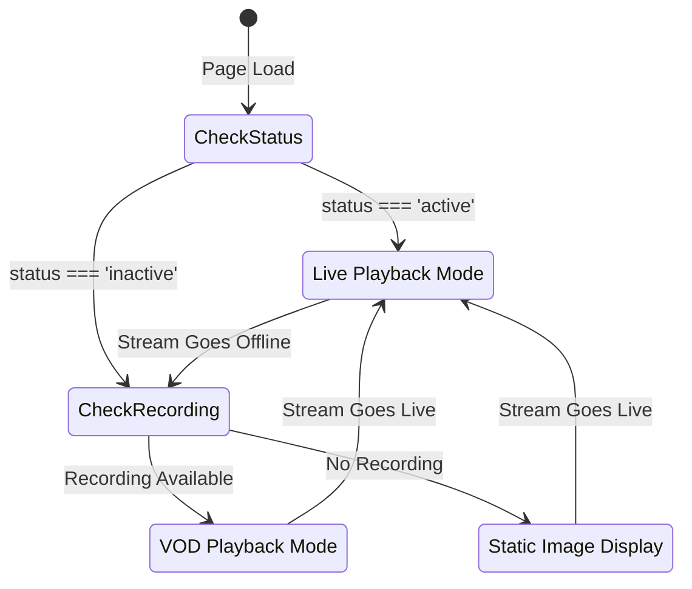

# Design Document: Offline Video Playback

## Overview

This design implements Video-On-Demand (VOD) playback for offline streams by
detecting stream status transitions and configuring the HLS player
appropriately. When a stream goes offline, the system will check if a recording
is available in S3 and switch from live streaming mode to VOD mode, allowing
viewers to watch the most recent recording with full seek capabilities.

The implementation focuses on modifying the existing `StreamPlayer.tsx`
component to handle two distinct playback modes: live streaming (for active
streams) and VOD playback (for inactive streams with recordings). The design
maintains backward compatibility with the existing live streaming functionality
while adding seamless transitions between modes.

## Architecture

### High-Level Flow



### Component Architecture

The design modifies the existing `StreamPlayer` component to support three
states:

1. **Live Mode**: Active stream with live HLS configuration
2. **VOD Mode**: Inactive stream with recording available, VOD HLS configuration
3. **Offline Mode**: Inactive stream with no recording, static image display

### State Management

The component will track:

- `streamDetail`: Current stream metadata (existing)
- `playbackMode`: 'live' | 'vod' | 'offline' (new)
- `recordingAvailable`: boolean indicating if VOD content exists (new)
- `previousStatus`: Track status transitions (existing)

## Components and Interfaces

### Modified StreamPlayer Component

**New State Variables:**

```typescript
const [playbackMode, setPlaybackMode] = useState<"live" | "vod" | "offline">(
  "offline",
);
const [recordingAvailable, setRecordingAvailable] = useState<boolean>(false);
```

**Modified Effects:**

1. **Status Transition Effect** (lines 144-153)
   - Currently destroys HLS player on transition to offline
   - Will be modified to check for recording availability
   - Will initialize VOD player if recording exists

2. **HLS Initialization Effect** (lines 156-350)
   - Currently only initializes for active streams
   - Will be modified to support both live and VOD modes
   - Will use different HLS configurations based on playback mode

### HLS Configuration Profiles

**Live Mode Configuration:**

```typescript
{
  enableWorker: true,
  lowLatencyMode: true,
  startLevel: -1,
  capLevelToPlayerSize: true,
  maxBufferLength: 30,
  maxMaxBufferLength: 60,
  liveSyncDurationCount: 3,
  liveMaxLatencyDurationCount: 10,
  liveDurationInfinity: true,
  // ... manifest loading config
}
```

**VOD Mode Configuration:**

```typescript
{
  enableWorker: true,
  lowLatencyMode: false,
  startLevel: -1,
  capLevelToPlayerSize: true,
  maxBufferLength: 30,
  maxMaxBufferLength: 60,
  startPosition: 0,
  // No live sync parameters
  // ... manifest loading config
}
```

### Recording Availability Check

**Function Signature:**

```typescript
const checkRecordingAvailability = async (manifestUrl: string): Promise<boolean>
```

**Implementation Approach:**

- Perform HEAD request to HLS manifest URL
- Check for 200 status code
- Optionally fetch and parse manifest to verify segments exist
- Return boolean indicating availability

**Error Handling:**

- Network errors → return false
- 404 errors → return false
- Timeout after 5 seconds → return false

## Data Models

### StreamDetailResponse (Existing)

No changes required to the existing type definition. The `hlsManifestUrl` field
will be used for both live and VOD playback.

### PlaybackMode (New)

```typescript
type PlaybackMode = "live" | "vod" | "offline";
```

### HLSConfig (Internal)

```typescript
type HLSConfig = {
  enableWorker: boolean;
  lowLatencyMode: boolean;
  startLevel: number;
  capLevelToPlayerSize: boolean;
  maxBufferLength: number;
  maxMaxBufferLength: number;
  liveSyncDurationCount?: number;
  liveMaxLatencyDurationCount?: number;
  liveDurationInfinity?: boolean;
  startPosition?: number;
  manifestLoadingTimeOut: number;
  manifestLoadingMaxRetry: number;
  manifestLoadingRetryDelay: number;
  manifestLoadingMaxRetryTimeout: number;
};
```

## Correctness Properties

_A property is a characteristic or behavior that should hold true across all
valid executions of a system—essentially, a formal statement about what the
system should do. Properties serve as the bridge between human-readable
specifications and machine-verifiable correctness guarantees._

### Property 1: Status Transition Triggers Correct Mode Change

_For any_ stream status transition, the playback mode should change
appropriately: active→inactive transitions should result in 'vod' mode (if
recording available) or 'offline' mode (if no recording), and inactive→active
transitions should always result in 'live' mode.

**Validates: Requirements 1.1, 5.1, 5.2, 6.1, 6.2**

### Property 2: VOD Configuration Excludes Live Parameters

_For any_ HLS configuration created for VOD mode, the configuration object
should not contain `liveSyncDurationCount`, `liveMaxLatencyDurationCount`, or
`liveDurationInfinity` properties, and should set `startPosition` to 0.

**Validates: Requirements 2.3, 3.1, 3.2, 3.3, 3.4**

### Property 3: Live Configuration Includes Required Live Parameters

_For any_ HLS configuration created for live mode, the configuration object
should contain `liveSyncDurationCount`, `liveMaxLatencyDurationCount`, and
`liveDurationInfinity` properties with appropriate non-zero values.

**Validates: Requirements 3.1, 3.2, 3.3**

### Property 4: Badge Display Matches Playback Mode

_For any_ playback mode state, the displayed badge text should match the mode:
'live' → "LIVE", 'vod' → "RECORDED", 'offline' → "OFFLINE".

**Validates: Requirements 4.1, 4.2, 6.3**

### Property 5: Recording Availability Determines Mode Selection

_For any_ inactive stream, if the recording availability check returns true,
then the playback mode should be set to 'vod', otherwise it should be set to
'offline'.

**Validates: Requirements 1.3, 1.4, 2.1**

### Property 6: UI Element Visibility Matches Playback Mode

_For any_ playback mode, the correct UI elements should be visible: 'live' or
'vod' modes should show the video player element, while 'offline' mode should
show the static image element.

**Validates: Requirements 2.1, 4.4, 4.5**

### Property 7: Mode Toggle Visibility Based on Playback Mode

_For any_ playback mode, the raw stream mode toggle control should be visible
only when mode is 'live', and hidden when mode is 'vod' or 'offline'.

**Validates: Requirements 9.1, 9.2**

### Property 8: HLS Instance Cleanup on Mode Transition

_For any_ playback mode transition, if an HLS instance exists before the
transition, it should be destroyed before creating a new instance for the new
mode.

**Validates: Requirements 5.1, 6.1**

### Property 9: VOD Mode Enables Full Seek Capabilities

_For any_ video player in VOD mode with loaded content, the seek functionality
should be enabled, the duration should be finite (not Infinity), and seeking to
any position within the duration should update the currentTime.

**Validates: Requirements 2.4, 7.2, 7.3, 7.4**

### Property 10: Error Fallback to Offline Mode

_For any_ error during recording availability check, VOD initialization, or
playback, the system should fall back to 'offline' mode displaying the last
frame image with "OFFLINE" badge.

**Validates: Requirements 5.5, 8.1, 8.2, 8.5**

## Error Handling

### Recording Availability Check Failures

**Scenario**: Network error or timeout when checking manifest availability

**Handling**:

- Log error to console
- Set `recordingAvailable` to false
- Fall back to offline mode with static image
- Continue polling for status changes

### VOD Playback Initialization Failures

**Scenario**: HLS player fails to load VOD manifest or segments

**Handling**:

- Catch HLS error events
- Log error details
- Destroy HLS instance
- Fall back to offline mode with static image
- Display error message to user

### Transition Failures

**Scenario**: Error during mode transition (live → VOD or VOD → live)

**Handling**:

- Ensure previous HLS instance is destroyed
- Log transition error
- Attempt to initialize new mode
- If initialization fails, fall back to offline mode
- Preserve error state for debugging

### Missing Segments in Recording

**Scenario**: VOD playlist references segments that don't exist

**Handling**:

- HLS.js will emit fragment load errors
- Allow HLS.js to attempt recovery
- If recovery fails, continue playing available segments
- Log missing segment information

## Testing Strategy

### Unit Tests

Unit tests will focus on specific examples and edge cases:

1. **Recording Availability Check**
   - Test with valid manifest URL returning 200
   - Test with 404 response
   - Test with network timeout
   - Test with malformed URL

2. **HLS Configuration Generation**
   - Test live mode config includes required live parameters
   - Test VOD mode config excludes live parameters
   - Test both configs include common parameters

3. **Badge Text Rendering**
   - Test "LIVE" badge for active stream
   - Test "RECORDED" badge for VOD mode
   - Test "OFFLINE" badge for offline mode

4. **Mode Toggle Visibility**
   - Test toggle visible in live mode
   - Test toggle hidden in VOD mode
   - Test toggle hidden in offline mode

### Property-Based Tests

Property-based tests will verify universal properties across all inputs. Each
test should run a minimum of 100 iterations.

1. **Property 1: Status Transition Triggers Correct Mode Change**
   - Generate random stream state transitions (active↔inactive)
   - Generate random recording availability states
   - Verify mode changes correctly: active→inactive with recording → 'vod',
     active→inactive without recording → 'offline', inactive→active → 'live'
   - **Tag**: Feature: offline-video-playback, Property 1: Status transition
     triggers correct mode change

2. **Property 2: VOD Configuration Excludes Live Parameters**
   - Generate random VOD configurations with various buffer and quality settings
   - Verify no live parameters present (liveSyncDurationCount,
     liveMaxLatencyDurationCount, liveDurationInfinity)
   - Verify startPosition is set to 0
   - **Tag**: Feature: offline-video-playback, Property 2: VOD configuration
     excludes live parameters

3. **Property 3: Live Configuration Includes Required Live Parameters**
   - Generate random live configurations with various settings
   - Verify all required live parameters present with non-zero values
   - **Tag**: Feature: offline-video-playback, Property 3: Live configuration
     includes required live parameters

4. **Property 4: Badge Display Matches Playback Mode**
   - Generate random playback modes ('live', 'vod', 'offline')
   - Verify badge text matches: 'live' → "LIVE", 'vod' → "RECORDED", 'offline' →
     "OFFLINE"
   - **Tag**: Feature: offline-video-playback, Property 4: Badge display matches
     playback mode

5. **Property 5: Recording Availability Determines Mode Selection**
   - Generate random inactive stream states with varying recording availability
   - Verify mode set to 'vod' when recording available, 'offline' when not
   - **Tag**: Feature: offline-video-playback, Property 5: Recording
     availability determines mode selection

6. **Property 6: UI Element Visibility Matches Playback Mode**
   - Generate random playback modes
   - Verify video player visible for 'live' and 'vod', static image visible for
     'offline'
   - **Tag**: Feature: offline-video-playback, Property 6: UI element visibility
     matches playback mode

7. **Property 7: Mode Toggle Visibility Based on Playback Mode**
   - Generate random playback modes
   - Verify toggle visible only for 'live' mode, hidden for 'vod' and 'offline'
   - **Tag**: Feature: offline-video-playback, Property 7: Mode toggle
     visibility based on playback mode

8. **Property 8: HLS Instance Cleanup on Mode Transition**
   - Generate random mode transitions with existing HLS instances
   - Verify HLS instance is destroyed before new instance creation
   - **Tag**: Feature: offline-video-playback, Property 8: HLS instance cleanup
     on mode transition

9. **Property 9: VOD Mode Enables Full Seek Capabilities**
   - Generate random VOD player states with loaded content
   - Verify seek enabled, duration is finite, and seeking updates currentTime
   - **Tag**: Feature: offline-video-playback, Property 9: VOD mode enables full
     seek capabilities

10. **Property 10: Error Fallback to Offline Mode**
    - Generate random error scenarios (availability check failure,
      initialization failure, playback error)
    - Verify system falls back to 'offline' mode with last frame image and
      "OFFLINE" badge
    - **Tag**: Feature: offline-video-playback, Property 10: Error fallback to
      offline mode

### Integration Tests

Integration tests will verify end-to-end flows:

1. **Complete Live to VOD Transition**
   - Start with active stream
   - Simulate status change to inactive
   - Verify VOD player initializes
   - Verify playback starts

2. **Complete VOD to Live Transition**
   - Start with inactive stream and recording
   - Simulate status change to active
   - Verify live player initializes
   - Verify live playback starts

3. **Initial Load with Recording**
   - Load page with inactive stream
   - Verify recording check occurs
   - Verify VOD player initializes
   - Verify playback starts

### Testing Library Selection

**For TypeScript/Preact**: Use `fast-check` for property-based testing

**Example Property Test Structure**:

```typescript
import fc from "fast-check";

describe("Property: VOD Mode Excludes Live Parameters", () => {
  it("should not include live parameters in VOD config", () => {
    fc.assert(
      fc.property(
        fc.record({
          // Generate random config parameters
        }),
        (config) => {
          const vodConfig = createVODConfig(config);
          expect(vodConfig).not.toHaveProperty("liveSyncDurationCount");
          expect(vodConfig).not.toHaveProperty("liveMaxLatencyDurationCount");
          expect(vodConfig).not.toHaveProperty("liveDurationInfinity");
        },
      ),
      { numRuns: 100 },
    );
  });
});
```
